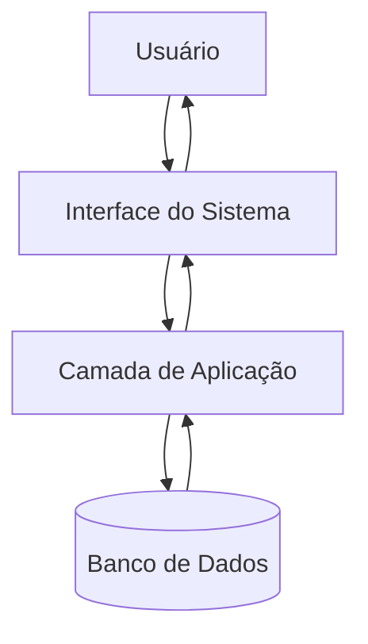
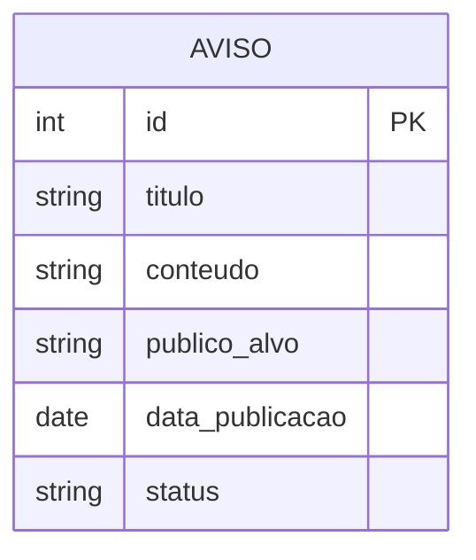
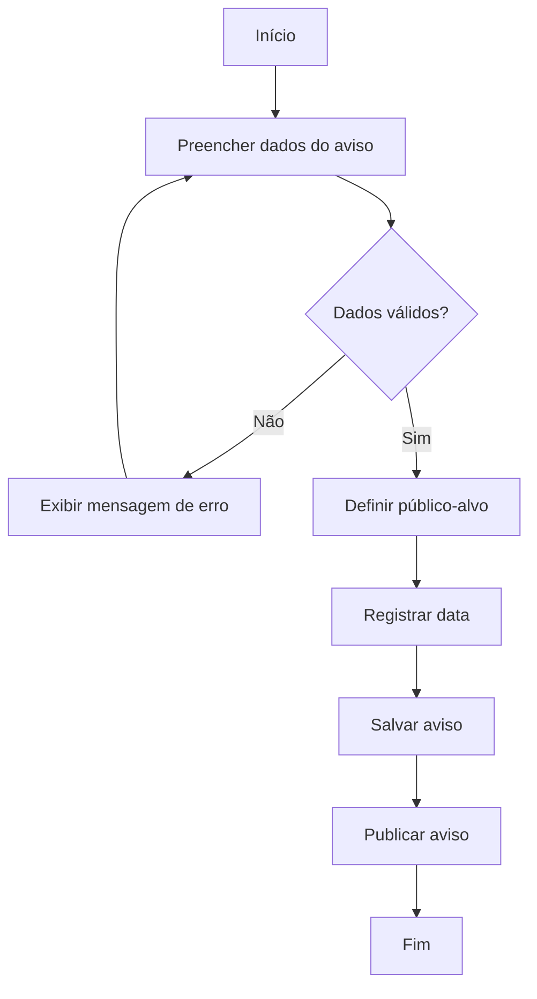
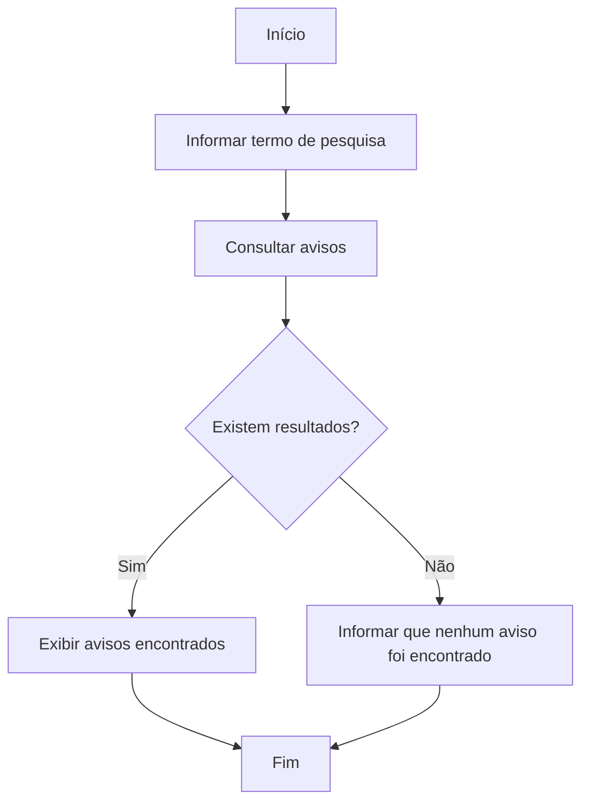
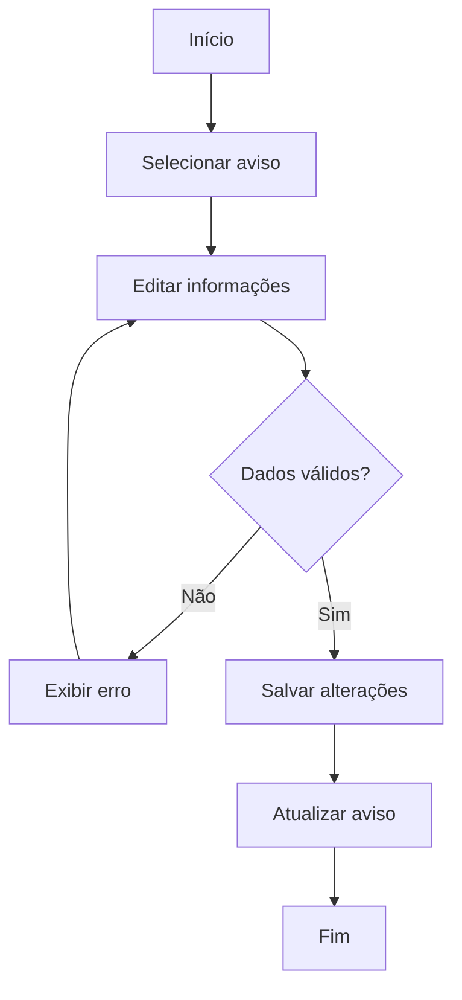

# Relatório de Arquitetura e Modelagem

## Projeto Integrador — Sistema de Avisos

### 1. Identificação

**Aluno:** Ebert Fernandes

**Objetivo do sistema:** desenvolver um sistema para gerenciamento de avisos, permitindo cadastrar, publicar, visualizar, pesquisar e editar avisos, além de definir o público-alvo e registrar a data de cada aviso.

---

## 2. Escopo da solução

O sistema terá como funcionalidades principais:

- Publicar aviso;
- Visualizar avisos;
- Editar aviso;
- Pesquisar aviso;
- Definir público-alvo;
- Registrar data do aviso;
- Testar o sistema;
- Corrigir erros encontrados durante a validação.

O sistema deverá organizar as informações de maneira simples, permitindo que os usuários encontrem os avisos relevantes com facilidade.

---

## 3. Arquitetura inicial

A solução pode ser organizada em três camadas:

### Interface
Responsável pela interação com o usuário, incluindo formulários, listagem de avisos, pesquisa e edição.

### Aplicação
Responsável pelas regras de negócio, como validação dos dados, publicação, pesquisa, edição e definição do público-alvo.

### Dados
Responsável pelo armazenamento das informações dos avisos.

Fluxo geral:



---

## 4. Modelo de dados inicial

A entidade principal do sistema é o **Aviso**.

| Campo | Descrição |
|---|---|
| id | Identificador único do aviso |
| titulo | Título do aviso |
| conteudo | Texto do aviso |
| publico_alvo | Público que deverá receber/visualizar o aviso |
| data_publicacao | Data de publicação do aviso |
| status | Situação do aviso |



---

## 5. Fluxo de publicação de aviso



---

## 6. Fluxo de pesquisa de avisos



---

## 7. Fluxo de edição de aviso



---

## 8. Requisitos funcionais relacionados

| Código | Requisito |
|---|---|
| RF01 | O sistema deve permitir publicar um aviso. |
| RF02 | O sistema deve permitir visualizar avisos publicados. |
| RF03 | O sistema deve permitir editar um aviso. |
| RF04 | O sistema deve permitir pesquisar avisos. |
| RF05 | O sistema deve permitir definir o público-alvo do aviso. |
| RF06 | O sistema deve registrar a data do aviso. |

### Requisitos não funcionais iniciais

| Código | Requisito |
|---|---|
| RNF01 | A interface deve ser simples e fácil de utilizar. |
| RNF02 | Os dados dos avisos devem ser armazenados de forma organizada. |
| RNF03 | O sistema deve validar os dados antes de salvar um aviso. |
| RNF04 | O sistema deve apresentar mensagens claras quando ocorrer um erro. |

---

## 9. Organização do trabalho no Trello

O quadro Kanban deve possuir as colunas:

1. **A Fazer**
2. **Em Andamento**
3. **Em Revisão**
4. **Concluído**

### Cartões

#### A Fazer
- Definir público-alvo
- Registrar data do aviso
- Pesquisar aviso
- Editar aviso
- Testar sistema
- Corrigir erros

#### Em Andamento
- Publicar aviso

#### Em Revisão
- Visualizar avisos

#### Concluído
- Nenhum cartão inicialmente.

Os cartões devem ser movidos entre as colunas conforme o andamento real do trabalho.

---

## 10. Prioridades, responsável e prazos

Como o projeto é individual, **todos os cartões têm o mesmo responsável: Ebert Fernandes**.

| Tarefa | Responsável | Prioridade |
|---|---|---|
| Publicar aviso | Ebert Fernandes | Alta |
| Visualizar avisos | Ebert Fernandes | Alta |
| Editar aviso | Ebert Fernandes | Média |
| Pesquisar aviso | Ebert Fernandes | Média |
| Definir público-alvo | Ebert Fernandes | Alta |
| Registrar data do aviso | Ebert Fernandes | Média |
| Testar sistema | Ebert Fernandes | Alta |
| Corrigir erros | Ebert Fernandes | Alta |

Os prazos devem ser preenchidos no próprio Trello de acordo com o cronograma definido para o trabalho.

---

## 11. Rastreabilidade Trello ↔ GitHub

Cada cartão do Trello deverá estar relacionado a uma alteração correspondente no GitHub, realizada pelo próprio aluno.

Exemplo de padrão para commits:

```text
feat: implementar publicação de avisos
feat: implementar visualização de avisos
feat: implementar edição de avisos
feat: implementar pesquisa de avisos
feat: implementar definição do público-alvo
feat: registrar data do aviso
test: testar funcionalidades do sistema
fix: corrigir erros encontrados nos testes
```

No cartão do Trello, deve ser colocado o link da Issue ou do commit correspondente no GitHub.

**Importante:** utilizar o link real do repositório, Issue ou commit do projeto. Não utilizar links fictícios.

---

## 12. Critério de conclusão das tarefas

Uma tarefa poderá ser considerada concluída quando:

- A funcionalidade estiver implementada;
- Os dados necessários forem validados;
- A funcionalidade tiver sido testada;
- Os erros encontrados tiverem sido corrigidos;
- A alteração correspondente estiver registrada no GitHub;
- O cartão estiver movido para a coluna adequada no Trello.

---

## 13. Conclusão

A modelagem apresentada organiza a estrutura inicial do Sistema de Avisos desenvolvido individualmente e estabelece o fluxo entre interface, aplicação e armazenamento de dados. A utilização do Trello permite acompanhar visualmente as tarefas, enquanto a rastreabilidade com o GitHub relaciona o planejamento às alterações realizadas no projeto.

Este documento corresponde ao relatório de Arquitetura/Modelagem solicitado na Etapa 2 do Projeto Integrador e deve ser colocado na pasta `/docs` do repositório.
